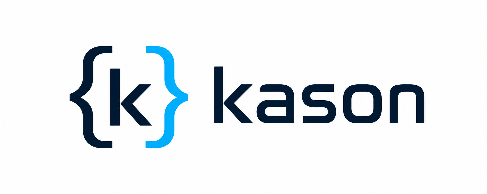

<p align="center">
  <picture>
    <source media="(prefers-color-scheme: dark)" srcset="docs/assets/kason-logo-dark.png">
    <source media="(prefers-color-scheme: light)" srcset="docs/assets/kason-logo.png">
    
  </picture>
</p>

# KaSON

KaSON—short for **Kasolik's JSON Parser**—is a small C99 JSON parser for fast,
allocation-free processing. Instead of building a DOM, it reports views into
the input buffer and lets the application enter, capture, or skip containers.
All auxiliary storage is supplied by the caller.

- Complete-buffer and chunked-stream parsing
- Selective lookup of top-level object fields
- String and number conversion helpers
- Direct conversion between JSON and fixed-layout C structures
- No heap allocation

[Quick start](#quick-start) · [API guide](docs/api-guide.md) ·
[Tutorial](docs/tutorial.md) · [Examples](examples)

## Choose an API

| Input or task | Recommended API |
| --- | --- |
| Complete NUL-terminated JSON | `kason_parse()` |
| Complete buffer with a known length | `kason_parse_range()` |
| Traverse a captured object or array | `kason_parse_container()` |
| Extract selected top-level fields | `kason_parse_selected()` |
| JSON arriving in chunks | `kason_stream_init()`, `kason_stream_feed()`, `kason_stream_finish()` |
| Decode JSON into a fixed C structure | `kason_unpack()` |
| Encode a fixed C structure as JSON | `kason_pack()` |

Start with the regular API when a complete document is available. Use the
stream API only when input genuinely arrives in chunks, and the schema API when
the program already has a stable C data model.

## Quick start

Build the library, examples, and tests:

```sh
cmake -S . -B build -DCMAKE_BUILD_TYPE=Release
cmake --build build
ctest --test-dir build --output-on-failure
```

Run the regular parsing example:

```sh
./build/regular
```

Expected output:

```text
name = Ada
age = 36
```

The example is in [`examples/regular.c`](examples/regular.c). It parses an
object, visits its fields, and converts a number without copying or
NUL-terminating its slice. The [tutorial](docs/tutorial.md) walks through the
regular, stream, and schema APIs with complete programs.

To compile the core library directly:

```sh
cc -std=c99 -O3 app.c kason.c -I. -o app
```

Schema support also requires `kason_schema.c`:

```sh
cc -std=c99 -O3 app.c kason.c kason_schema.c -I. -o app
```

## Use from CMake

Install KaSON to a prefix:

```sh
cmake --install build --prefix /path/to/prefix
```

Then consume the installed package:

```cmake
find_package(kason CONFIG REQUIRED)

target_link_libraries(my_parser PRIVATE kason::kason)
# Or, for the schema API:
target_link_libraries(my_config_loader PRIVATE kason::schema)
```

KaSON can instead be included directly in a CMake project:

```cmake
add_subdirectory(path/to/kason)
target_link_libraries(my_parser PRIVATE kason::kason)
```

Common configuration options are:

| Option | Default | Purpose |
| --- | --- | --- |
| `KaSON_BUILD_TESTS` | on for a top-level build | Unit and conformance tests |
| `KaSON_BUILD_EXAMPLES` | on for a top-level build | Example programs |
| `BUILD_SHARED_LIBS` | off | Build shared rather than static libraries |

Benchmark, fuzzing, sanitizer, and documentation options are described under
[Development](#development).

## Parsing model

The regular parser calls the application when it encounters a value or starts
a container. For an object or array, the callback chooses an action:

| Action | Result |
| --- | --- |
| `KaSON_ACTION_ENTER` | Visit its immediate children, then report its end |
| `KaSON_ACTION_CAPTURE` | Validate it, then report its complete JSON slice |
| `KaSON_ACTION_SKIP` | Validate it without reporting its contents |
| `KaSON_ACTION_BREAK` | Stop successfully |

`kason_parse()` accepts a NUL-terminated buffer. `kason_parse_range()` accepts
an inclusive `[begin, end]` range, so an empty buffer must be handled before
forming `end`.

For escaped strings, compare decoded contents with `kason_strcmp()` or copy them
with `kason_strcpy()`. Number slices can be converted directly with helpers such
as `kason_value_to_int64()` and `kason_value_to_double()`.

See the [API guide](docs/api-guide.md) for event semantics, selected-key parsing,
conversion results, errors, and thread safety.

## Memory and lifetime

- Core parsing performs no heap allocation and uses bounded stack state.
- Schema storage, lookup tables, output buffers, and stream scratch space belong
  to the caller.
- Keys and values are inclusive pointer ranges into the input buffer.
- A saved slice remains valid only while its input buffer remains valid and
  unchanged.
- The maximum nesting depth defaults to `KaSON_MAX_NESTING == 128` and can be
  overridden at compile time.

The stream API has stricter lifetimes: callback pointers are valid only for the
duration of the callback. Its scratch buffer must accommodate tokens crossing
chunk boundaries and nested-container tracking.

## Examples and documentation

| Resource | Contents |
| --- | --- |
| [`docs/tutorial.md`](docs/tutorial.md) | Guided regular, stream, and schema examples |
| [`docs/api-guide.md`](docs/api-guide.md) | API selection, semantics, ownership, errors, and thread safety |
| [`examples/regular.c`](examples/regular.c) | Complete-buffer parsing |
| [`examples/stream.c`](examples/stream.c) | Chunked input |
| [`examples/schema.c`](examples/schema.c) | Basic struct decoding and encoding |
| [`examples/schema_config.c`](examples/schema_config.c) | Nested configuration schema |

The example build also creates `json_to_yaml`, `json_pretty`, and
`json_compact`. They read standard input and write standard output when called
without arguments, or accept input and output paths:

```sh
printf '%s' '{"answer":42}' | build/json_to_yaml
build/json_pretty input.json
build/json_compact input.json output.json
build/json_to_yaml input.json output.yaml
```

Generate searchable API documentation with Doxygen installed:

```sh
cmake -S . -B build-docs -DKaSON_BUILD_DOCS=ON
cmake --build build-docs --target docs
```

## Performance

KaSON is designed for predictable, application-owned storage rather than DOM
construction. The included benchmark compares its range, selected-field,
schema, and stream APIs with optional external JSON libraries. Results depend
on the compiler, CPU, input shape, callback work, and available dependencies.

```sh
cmake -S . -B build-bench \
  -DCMAKE_BUILD_TYPE=Release \
  -DKaSON_BUILD_BENCHMARK=ON
cmake --build build-bench
./build-bench/bench_kason
```

## Development

Additional build options include:

| Option | Default | Purpose |
| --- | --- | --- |
| `KaSON_BUILD_BENCHMARK` | off | Comparison benchmark |
| `KaSON_BUILD_FUZZER` | off | Clang libFuzzer target |
| `KaSON_ENABLE_SANITIZERS` | off | AddressSanitizer and UndefinedBehaviorSanitizer |
| `KaSON_BUILD_DOCS` | off | Searchable Doxygen API documentation |

Run the test suite with sanitizers:

```sh
cmake -S . -B build-asan \
  -DKaSON_ENABLE_SANITIZERS=ON \
  -DCMAKE_BUILD_TYPE=Debug
cmake --build build-asan
ctest --test-dir build-asan --output-on-failure
```

With Clang, build and run the libFuzzer target:

```sh
cmake -S . -B build-fuzz \
  -DCMAKE_C_COMPILER=clang \
  -DKaSON_BUILD_FUZZER=ON
cmake --build build-fuzz
./build-fuzz/fuzz_kason tests/fuzz_corpus
```

## License

KaSON is released under the [MIT License](LICENSE).
